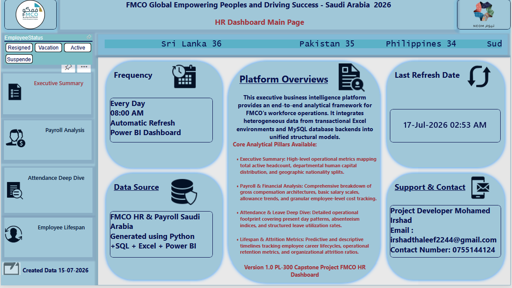

# FMCO HR Analytics Dashboard

## 📊 Project Overview
This repository contains a comprehensive, interactive **HR Analytics Power BI Dashboard** developed for **FMCO**. The project transforms raw human resources data into actionable business intelligence, helping management track workforce demographics, monitor key performance metrics, and optimize strategic decision-making.

---

## 🔑 Key Features & Dashboards
The report is designed with a multi-page layout focusing on distinct HR vectors:
* **Workforce Demographics:** Deep-dive analysis into employee distribution, departments, and tenure.
* **Performance Metrics:** Real-time tracking of employee achievements, KPI targets, and developmental needs.
* **Operational Insights:** Strategic visualizations built to assist HR management with predictive staffing and retention.

---

## 🛠️ Tech Stack & Tools Used
* **Power BI Desktop:** Dashboard design, modeling, and custom visual integrations.
* **DAX (Data Analysis Expressions):** Engineered advanced measures for dynamic calculations.
* **Power Query (M):** Comprehensive ETL processes, data cleaning, and column transformations.
* **Specialized Visuals:** Integrated high-impact custom visuals including the **Chiclet Slicer** for refined filtering and a **Scrolling Text Visual** for live HR news/announcements.

---

## 📈 Future Improvements (Roadmap)
To take this project to the next level, the following upgrades are planned:
1. **Predictive Attrition Modeling:** Integrate a Python or Azure Machine Learning script to forecast employee turnover risks based on historical patterns.
2. **MySQL Database Integration:** Migrate static data storage to a live **MySQL Database** to enable real-time dashboard refreshes.
3. **Enhanced Row-Level Security (RLS):** Implement advanced dynamic DAX filters so department managers can only view their respective team's data.
4. **Mobile Optimization:** Create a dedicated mobile view layout within Power BI for on-the-go management access.

---

## 📸 Dashboard Preview

  
    
  
    
  
    
  
    
  
    
  

---

## 🚀 How to View the Project
* **Project Status:** This project contains confidential company data for FMCO. For data privacy and security, the live interactive link is restricted.
* **Visual Preview:** Please refer to the **Dashboard Preview** section above to view the high-quality screenshots of the report layout and design.
* **Download File:** You can clone this repository and download the `FMCO HR DASHBOARD.pbix` file to explore the data model structure locally.
